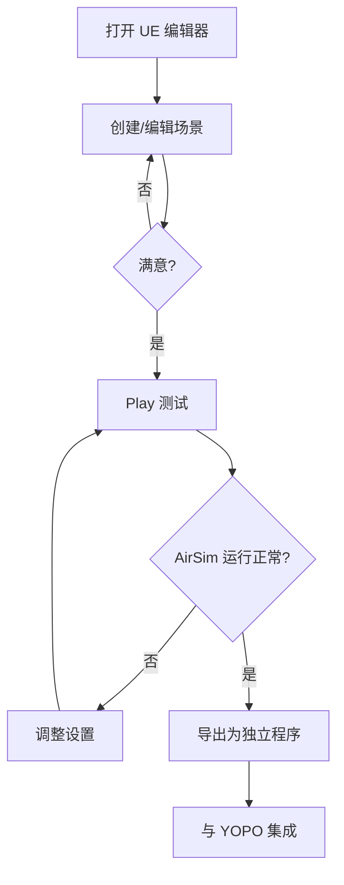

# ForestDrone - AirSim 森林仿真环境


逼真的森林环境，专为 AirSim 无人机自主导航和 YOPO 项目设计。

---

## 📖 目录

- [项目概述](#项目概述)
- [功能特性](#功能特性)
- [快速开始](#快速开始)
- [项目结构](#项目结构)
- [详细文档](#详细文档)
- [示例场景](#示例场景)
- [性能要求](#性能要求)
- [常见问题](#常见问题)

---

## 项目概述

**ForestDrone** 是一个为 AirSim 无人机导航设计的 Unreal Engine 4.27 森林环境项目，包含：

- 🌲 **大规模森林**: 程序化生成或手动绘制的密集树林
- 🏔️ **起伏地形**: 自然的山丘、山谷和平坦起飞区
- ☀️ **动态时间**: 完整的昼夜循环系统
- 🌦️ **天气系统**: 晴天、多云、雨天、暴风雨、雾天
- 🎵 **环境音效**: 鸟鸣、风声、雨声等 3D 空间音效
- 🦋 **视觉特效**: 粒子系统 (雨滴、雾气、树叶飘落)
- ⚡ **性能优化**: LOD、流送、实例化等优化技术
- 🎮 **交互控制**: 实时调整环境参数的蓝图系统

---

## 功能特性

### 1. 真实感森林

- **多样树种**: 松树、橡树、桦树、云杉等
- **多层植被**: 高大树木 + 中等灌木 + 地面草地
- **自然分布**: 非均匀分布，模拟真实森林
- **季节变化** (可选): 春夏秋冬叶色变化

### 2. 高级光照

- **物理天空**: Sky Atmosphere 真实大气散射
- **体积云**: 动态云层系统
- **动态阴影**: CSM 级联阴影映射
- **体积雾**: 距离雾和高度雾

### 3. 天气模拟

| 天气类型 | 云量 | 雾气 | 粒子效果 | 音效 |
|---------|------|------|---------|------|
| **晴天** | 20% | 低 | - | 鸟鸣 |
| **多云** | 60% | 中 | - | 风声 |
| **雨天** | 80% | 高 | 雨滴 | 雨声 + 雷声 |
| **暴风雨** | 100% | 很高 | 大雨 | 暴雨 + 闪电 |
| **雾天** | 50% | 极高 | 雾气粒子 | 安静 |

### 4. 交互功能

**键盘快捷键**:
- `T` - 循环时间 (白天 ↔ 夜晚)
- `W` - 循环天气
- `F` - 切换雾效
- `R` - 重置相机
- 鼠标滚轮 - 调整时间流速

### 5. AirSim 集成

- ✅ 完整碰撞检测 (无穿透)
- ✅ 深度相机支持 (Custom Depth)
- ✅ 预定义起飞点 (Player Start)
- ✅ 可视化飞行路径
- ✅ 性能优化 (稳定 30+ FPS)

---

## 快速开始

### 前提条件

#### 必需软件

- **Unreal Engine 4.27.x** (已编译)
- **AirSim 1.8.1** (已编译)
- **Ubuntu 20.04** 或 **Windows 10/11**
- **NVIDIA GPU** (GTX 1060+ / 4GB+ VRAM)

#### 硬件要求

| 组件 | 最低配置 | 推荐配置 |
|-----|---------|---------|
| CPU | Intel i5-8400 | Intel i7-9700K |
| GPU | GTX 1060 (6GB) | RTX 2060 (8GB) |
| RAM | 16GB | 32GB |
| 存储 | 20GB | 50GB SSD |

### 安装步骤

#### 步骤 1: 克隆项目 (或创建)

```bash
# 项目已在此路径
cd /home/user/YOPO/UnrealProjects/ForestDrone
```

#### 步骤 2: 安装 AirSim 插件

```bash
./setup_airsim_plugin.sh
```

**脚本会自动**:
- 复制 AirSim 插件到 `Plugins/AirSim`
- 配置 settings.json
- 创建必要的符号链接

#### 步骤 3: 打开项目

```bash
cd ~/UnrealEngine
./Engine/Binaries/Linux/UE4Editor ~/YOPO/UnrealProjects/ForestDrone/ForestDrone.uproject
```

**首次打开**:
- UE 会提示重新编译插件 → 点击 **Yes**
- 等待编译完成 (3-5 分钟)

#### 步骤 4: 创建场景

详细步骤见 [FOREST_SCENE_GUIDE.md](FOREST_SCENE_GUIDE.md)

**快速流程**:

1. **创建主地图**: File → New Level → Empty Level
   - 保存为 `/Game/Maps/ForestMain`

2. **添加地形**:
   - Shift+2 (Landscape Mode)
   - Manage → Create (32x32 components)
   - Sculpt → 雕刻山丘和山谷

3. **绘制植被**:
   - Shift+4 (Foliage Mode)
   - 拖拽树木模型 (从 Quixel Megascans)
   - Paint → 绘制森林

4. **添加光照**:
   - Directional Light (太阳)
   - Sky Atmosphere
   - Exponential Height Fog

5. **创建蓝图** (可选):
   - BP_TimeOfDayController
   - BP_WeatherController
   - BP_EnvironmentController

6. **测试运行**:
   - Alt+P (Play)
   - `;` (AirSim 子窗口)

---

## 项目结构

```
ForestDrone/
│
├── ForestDrone.uproject          # UE 项目文件
├── Config/                       # 配置文件
│   ├── DefaultEngine.ini         # 引擎设置
│   ├── DefaultGame.ini           # 游戏设置
│   └── DefaultInput.ini          # 输入映射
│
├── Content/                      # 内容资产 (在 UE 内创建)
│   ├── Maps/
│   │   └── ForestMain.umap       # 主场景
│   ├── Blueprints/
│   │   ├── BP_GameMode_Forest    # 游戏模式
│   │   ├── BP_EnvironmentController
│   │   ├── BP_TimeOfDayController
│   │   ├── BP_WeatherController
│   │   └── BP_ForestGenerator
│   ├── Materials/
│   │   ├── M_Landscape_Forest    # 地形材质
│   │   └── M_Tree_Master         # 树木主材质
│   ├── Foliage/                  # 植被资产
│   ├── Audio/                    # 音效
│   └── Particles/                # 粒子系统
│
├── Plugins/
│   └── AirSim/                   # AirSim 插件 (自动安装)
│
├── Documentation/
│   ├── README.md                 # 本文件
│   ├── FOREST_SCENE_GUIDE.md     # 场景创建指南
│   ├── PERFORMANCE_OPTIMIZATION.md
│   └── Blueprints/
│       └── README_Blueprints.md  # 蓝图系统文档
│
└── setup_airsim_plugin.sh        # AirSim 安装脚本
```

---

## 详细文档

### 📚 核心文档

| 文档 | 描述 | 页数 |
|-----|------|------|
| **[FOREST_SCENE_GUIDE.md](FOREST_SCENE_GUIDE.md)** | 完整场景创建指南 (地形、植被、光照、天气) | 60+ |
| **[PERFORMANCE_OPTIMIZATION.md](PERFORMANCE_OPTIMIZATION.md)** | 性能优化策略和最佳实践 | 40+ |
| **[Blueprints/README_Blueprints.md](Blueprints/README_Blueprints.md)** | 蓝图系统和脚本文档 | 50+ |

### 🔗 相关文档

在 `/home/user/YOPO` 根目录:

| 文档 | 描述 |
|-----|------|
| **AIRSIM_MIGRATION_GUIDE.md** | AirSim + ROS 集成指南 |
| **AIRSIM_README.md** | AirSim 快速入门 |
| **YOPO_COMPREHENSIVE_ANALYSIS.md** | YOPO 系统分析 |

---

## 示例场景

### 场景 1: 简单森林

**适合**: 快速测试、低端硬件

```yaml
特性:
  - 地形: 平坦 (轻微起伏)
  - 树木密度: 低 (0.5 /1Kuu²)
  - 树种: 2-3 种
  - 天气: 固定晴天
  - 性能: 45-60 FPS (GTX 1060)
```

**创建时间**: 30 分钟

### 场景 2: 复杂森林

**适合**: 高级导航、性能测试

```yaml
特性:
  - 地形: 起伏山丘 + 山谷
  - 树木密度: 中 (1.0 /1Kuu²)
  - 树种: 5-7 种
  - 灌木层: 中密度
  - 天气: 动态 (晴 → 雨)
  - 光照: 动态昼夜
  - 性能: 35-50 FPS (GTX 1660)
```

**创建时间**: 2-3 小时

### 场景 3: 超级森林

**适合**: 真实感测试、展示

```yaml
特性:
  - 地形: 大规模 (4km x 4km)
  - 树木密度: 高 (1.5 /1Kuu²)
  - 树种: 10+ 种
  - 多层植被: 树木 + 灌木 + 草地 + 花朵
  - 天气: 所有类型 + 转换动画
  - 光照: 动态 + 体积云
  - 音效: 完整 3D 音效系统
  - 特效: 雨滴、雾气、树叶飘落
  - 野生动物: 鹿、鸟 (可选)
  - 性能: 30-40 FPS (RTX 2060)
```

**创建时间**: 1-2 天

---

## 性能要求

### 目标帧率

| 硬件配置 | 简单场景 | 复杂场景 | 超级场景 |
|---------|---------|---------|---------|
| **高端** (RTX 3070+) | 60 FPS | 55 FPS | 45 FPS |
| **中端** (GTX 1660+) | 50 FPS | 40 FPS | 32 FPS |
| **低端** (GTX 1060) | 45 FPS | 32 FPS | 28 FPS |

**注意**: AirSim 深度相机需要 ≥30 FPS 才能稳定工作。

### 性能优化

如果 FPS < 30:

1. **降低 Foliage 密度**:
   ```
   控制台 (~键): foliage.DensityScale 0.5
   ```

2. **减少阴影距离**:
   ```ini
   Directional Light → Dynamic Shadow Distance: 8000 → 5000
   ```

3. **禁用体积云**:
   ```
   Volumetric Cloud → Visible: ✗
   ```

4. **降低分辨率**:
   ```
   r.ScreenPercentage 90
   ```

详细优化见 [PERFORMANCE_OPTIMIZATION.md](PERFORMANCE_OPTIMIZATION.md)

---

## 使用流程

### 开发工作流



### 与 YOPO 集成

1. **启动 Unreal Engine + AirSim**:
   ```bash
   cd ForestDrone/Saved/StagedBuilds/LinuxNoEditor
   ./ForestDrone.sh -ResX=1280 -ResY=720 -windowed
   ```

2. **启动 AirSim ROS 节点**:
   ```bash
   cd ~/YOPO/Controller
   source devel/setup.bash
   roslaunch airsim_ros_pkgs airsim_yopo.launch
   ```

3. **启动 YOPO 规划器**:
   ```bash
   cd ~/YOPO/YOPO
   python3 test_yopo_ros.py --trial=1 --epoch=50
   ```

4. **设置目标点**:
   - RViz → "2D Nav Goal"
   - 点击场景中的目标位置

详细步骤见 [AIRSIM_README.md](../../AIRSIM_README.md)

---

## 资产资源

### 推荐免费资产

#### Quixel Megascans (推荐)

**Epic Games 账号免费**:

1. 打开 **Quixel Bridge**
2. 搜索并下载:
   - **Trees**: European Beech, Norway Spruce, Scots Pine
   - **Vegetation**: Ferns, Grass, Bushes
   - **Rocks**: Forest Rocks Pack
   - **Ground**: Forest Floor, Moss

#### UE Marketplace 免费资源

- **Open World Demo Collection** (Epic Games)
- **Landscape Mountains** (官方)
- **Nature Pack** (社区)

#### 音效资源

- **Freesound.org**: 鸟鸣、风声、雨声
- **Zapsplat.com**: 环境音效

### 创建自定义资产

**使用 SpeedTree**:

1. **Window** → **SpeedTree Modeler**
2. 创建自定义树木
3. 导出为 `.st` 文件
4. 导入 UE

---

## 常见问题

### Q1: 项目无法打开？

**A**:
1. 检查 UE 版本是否为 4.27.x:
   ```bash
   ~/UnrealEngine/Engine/Binaries/Linux/UE4Editor --version
   ```
2. 如果提示插件不兼容 → 允许重新编译

### Q2: AirSim 插件安装失败？

**A**:
1. 确认 AirSim 已编译:
   ```bash
   ls ~/AirSim/Unreal/Plugins/AirSim/
   ```
2. 手动复制插件:
   ```bash
   cp -r ~/AirSim/Unreal/Plugins/AirSim ~/YOPO/UnrealProjects/ForestDrone/Plugins/
   ```

### Q3: 性能很差 (FPS < 20)？

**A**:
1. 检查GPU驱动:
   ```bash
   nvidia-smi
   ```
2. 降低场景复杂度:
   - 减少树木密度 (foliage.DensityScale 0.3)
   - 禁用体积云和雾
   - 降低阴影质量 (sg.ShadowQuality 1)

### Q4: 深度相机无输出？

**A**:
1. 检查 Custom Depth:
   - Foliage → Render Custom Depth: ✓
2. 检查 AirSim 设置:
   ```json
   // ~/Documents/AirSim/settings.json
   "ImageType": 2  // DepthPlanar
   ```

### Q5: 无人机穿过树木？

**A**:
1. 检查碰撞:
   - Foliage → Collision Presets: **BlockAll**
2. 检查 Mobility:
   - Foliage → Mobility: **Static**

### Q6: 如何导出独立程序？

**A**:
1. **File** → **Package Project** → **Linux**
2. 选择输出目录
3. 等待打包完成 (10-30 分钟)
4. 运行:
   ```bash
   cd Output/LinuxNoEditor
   ./ForestDrone.sh
   ```

---

## 键盘快捷键

### UE 编辑器

| 快捷键 | 功能 |
|-------|------|
| `Alt+P` | Play / Stop |
| `F8` | Eject (退出控制) |
| `Shift+2` | Landscape Mode |
| `Shift+4` | Foliage Mode |
| `~` | Console (控制台) |
| `Ctrl+S` | Save |

### AirSim (游戏中)

| 快捷键 | 功能 |
|-------|------|
| `;` | Toggle AirSim 子窗口 |
| `F1` | 切换相机视角 |
| `B` | Toggle Manual Camera |

### 自定义 (场景中)

| 快捷键 | 功能 |
|-------|------|
| `T` | 循环昼夜 |
| `W` | 循环天气 |
| `F` | 切换雾效 |
| `R` | 重置相机 |

---

## 控制台命令

常用性能调试命令 (按 `~` 键):

```bash
# 性能统计
stat fps                    # 显示帧率
stat unit                   # CPU/GPU 时间
stat gpu                    # GPU 详情

# 质量调整
sg.ViewDistanceQuality 2    # 视野距离 (0-3)
sg.FoliageQuality 1         # 植被质量 (0-3)
sg.ShadowQuality 2          # 阴影质量 (0-3)
sg.PostProcessQuality 2     # 后处理质量 (0-3)

# Foliage 控制
foliage.DensityScale 0.5    # 减少植被密度
foliage.LODDistanceScale 0.8  # 降低LOD距离

# 调试
show Collision              # 显示碰撞
show Foliage                # 切换植被可见性
viewmode unlit              # 无光照模式
viewmode lit                # 正常光照
```

---

## 贡献指南

欢迎贡献改进！

### 如何贡献

1. **Bug 报告**: 提交 Issue 描述问题
2. **功能请求**: 提交 Feature Request
3. **代码贡献**: Fork → 修改 → Pull Request
4. **资产分享**: 分享自定义场景或蓝图

### 改进方向

- [ ] 更多预设场景
- [ ] 季节变化系统
- [ ] 野生动物 AI
- [ ] 动态树木生长
- [ ] 河流和瀑布系统
- [ ] 更多天气类型 (雪、冰雹)

---

## 许可证

本项目基于 MIT 许可证。

AirSim 和 Unreal Engine 使用各自的许可证。

---

## 鸣谢

- **Microsoft AirSim Team**: 优秀的仿真平台
- **Epic Games**: Unreal Engine 和 Quixel Megascans
- **YOPO Project**: 原始无人机导航系统

---

## 联系方式

- **项目主页**: `/home/user/YOPO`
- **相关文档**: 见 `/home/user/YOPO` 根目录
- **YOPO 集成**: 参考 `AIRSIM_MIGRATION_GUIDE.md`

---

**项目版本**: 1.0
**创建日期**: 2025-11-19
**Unreal Engine**: 4.27.1
**AirSim**: 1.8.1
**兼容平台**: Linux, Windows
